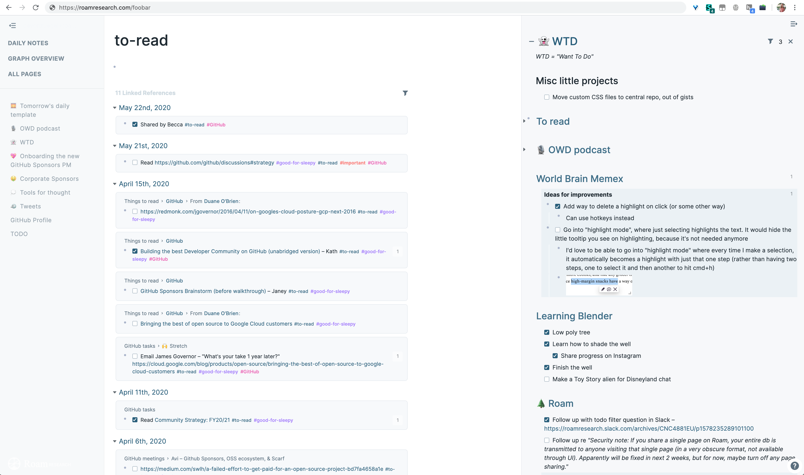
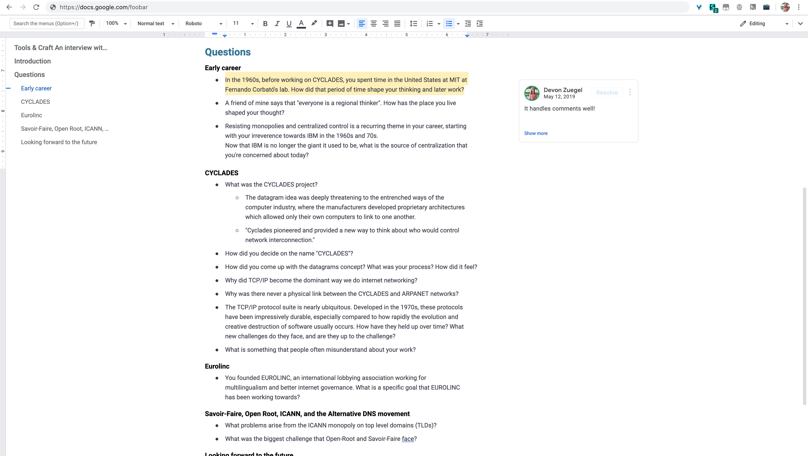

# Digital nesting 🐣
Hello! Welcome to the place where I collect my custom CSS, or as I like to call it my "digital nesting".

These files used to live in gists, but then I made so many of them for sites all around the internet that I decided it was finally time to break it out into its own little project.

You're welcome to borrow or tweak any of these custom styles. I've set them up on my browser using the [Stylus](https://chrome.google.com/webstore/detail/stylus/clngdbkpkpeebahjckkjfobafhncgmne) Chrome extension, but if you're not on Chroem these should work with any other sort of browser CSS injector too.

### Table of contents:

- [Roam](#roam)
- [Google Docs](#google-docs)
- [Twitter](#twitter)
- [Zoom](#zoom)

## Roam

[`roam.css`](roam.css)

## Google Docs

[`google-docs.css`](google-docs.css) &nbsp;&nbsp;·&nbsp;&nbsp; [More info](https://twitter.com/devonzuegel/status/1127421463647023104)

I don't like that Google Docs still imposes the sheet-of-paper metaphor. I ~never print my documents, so I wrote custom CSS for Google Docs to embrace the fact that they really are just dynamic webpages.

## Twitter

[`twitter.css`](twitter.css)  &nbsp;&nbsp;·&nbsp;&nbsp; [More info](https://twitter.com/devonzuegel/status/1254262711979929600)

When I go to Twitter to for a particular task (e.g. look at a work-related tweet), I invariably find myself distracted by my feed before I make any progress.

To combat that, I added some custom CSS to https://twitter.com so I stop making that mistake!

It also neatens up the styles and removes some of the modules that I never use.

## Zoom

This script closes Zoom tabs once you've opened the app successfully:
https://gist.github.com/devonzuegel/66d6269b3ff6e242ed2badd36f902344