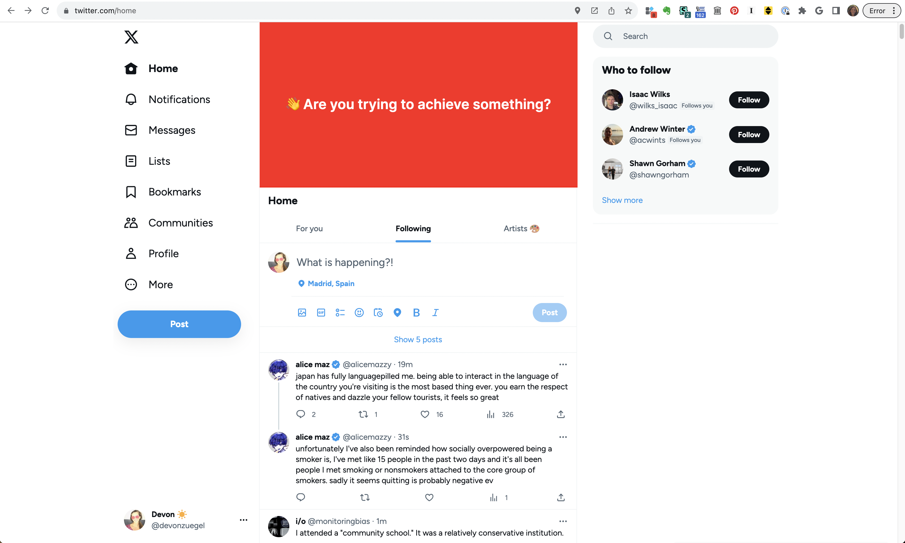
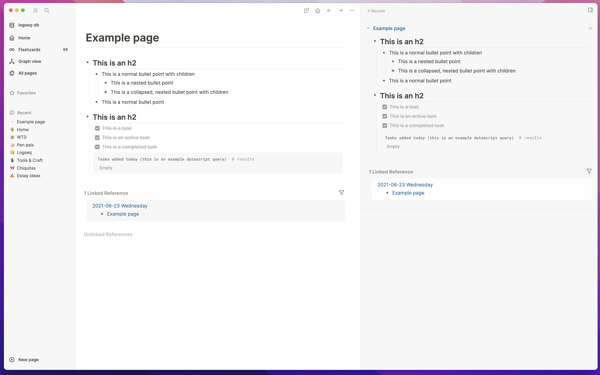
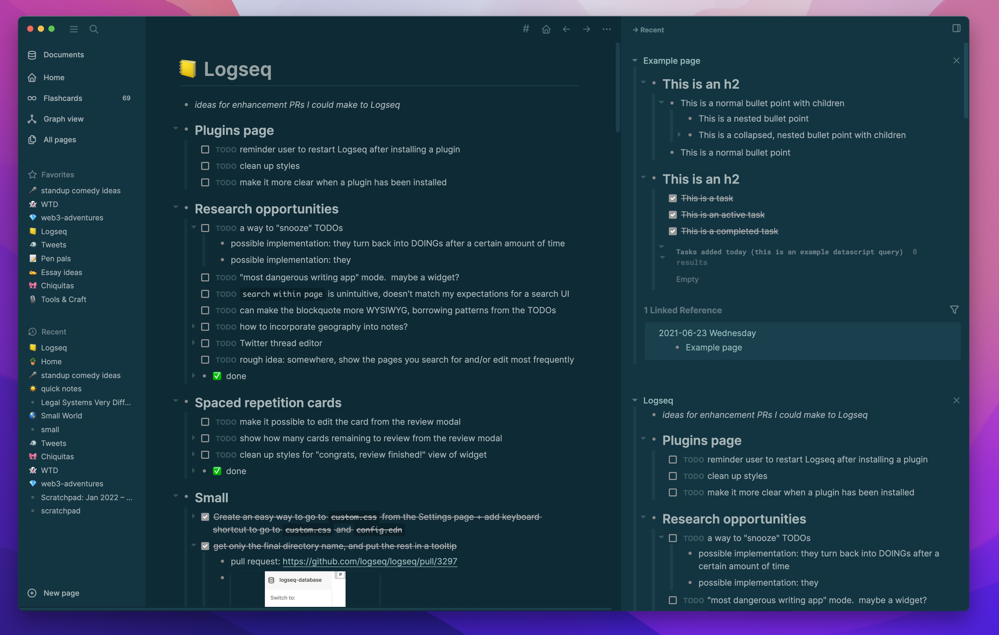
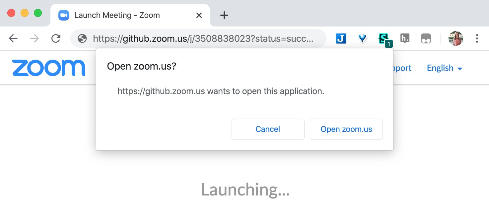

<h1>Digital nesting 🐣</h1> <!-- This h1 is a manual tag so it doesn't get pulled into the auto-generated ToC -->

Hello! Welcome to the place where I collect my custom CSS and other custom configuration, or as I like to call it my "digital nesting".

These files used to live in gists, but then I made so many of them for sites all around the internet that I decided it was finally time to break it out into its own little project.

You're welcome to borrow or tweak any of these custom styles.

**Table of contents:**
- [Twitter](#twitter)
- [Logseq](#logseq)
- [Google Docs](#google-docs)
- [Zoom](#zoom)
- [Roam](#roam)

# How to use these styles
Some of the styles here are loaded through a CSS/JS customizer browser extensoin. Chrome is my primary browser, so I use:
- [Stylus](https://chrome.google.com/webstore/detail/stylus/clngdbkpkpeebahjckkjfobafhncgmne) to manage my custom styles.
- [TamperMonkey](https://chrome.google.com/webstore/detail/tampermonkey/dhdgffkkebhmkfjojejmpbldmpobfkfo?hl=en) to manage my custom Javascript scripts.

If you don't use Chrome, these files should work with any other sort of browser CSS and JS managers too, maybe with some minor tweaks.

# Applications

### Twitter

[`twitter/twitter.css`](twitter/twitter.css)  &nbsp;&nbsp;·&nbsp;&nbsp; [`twitter/slow-load.tampermonkey.js`](twitter/slow-load.tampermonkey.js)  &nbsp;&nbsp;·&nbsp;&nbsp; [More info](https://twitter.com/devonzuegel/status/1254262711979929600)

When I go to Twitter to for a particular task (e.g. look at a work-related tweet), I invariably find myself distracted by my feed before I make any progress.

To combat that, I added some custom CSS to https://twitter.com so I stop making that mistake!

It also neatens up the styles and removes some of the modules that I never use.

### Logseq

[`logseq/custom.css`](logseq/custom.css) &nbsp; · &nbsp; [`logseq/config.edn`](logseq/config.edn) · &nbsp; [`logseq/queries.md`](logseq/queries.md)

Logseq is the primary note taking app I use these days. It has great base styles, but I just had a few tiny things I wanted to tweak. I've also shared the primary [queries](logseq/queries.md) I have embedded in my Home page to save you the hassle of writing them yourself.

### Google Docs

[`google-docs/google-docs.css`](google-docs/google-docs.css) &nbsp;&nbsp;·&nbsp;&nbsp; [More info](https://twitter.com/devonzuegel/status/1127421463647023104)

I don't like that Google Docs still imposes the sheet-of-paper metaphor. I roughly never print my documents, so I wrote custom CSS for Google Docs to embrace the fact that they really are just dynamic webpages.

### Zoom

[`zoom/zoom.js`](zoom/zoom.js)  &nbsp;&nbsp;·&nbsp;&nbsp; [More info](https://twitter.com/devonzuegel/status/1242590822740049921)

If orphaned Zoom  tabs annoy you as much as they annoy me, I have a little gift for you! [This TamperMonkey script](zoom.js) automatically closes those tabs on success.

### Roam

[`roam/roam.css`](roam/roam.css)

